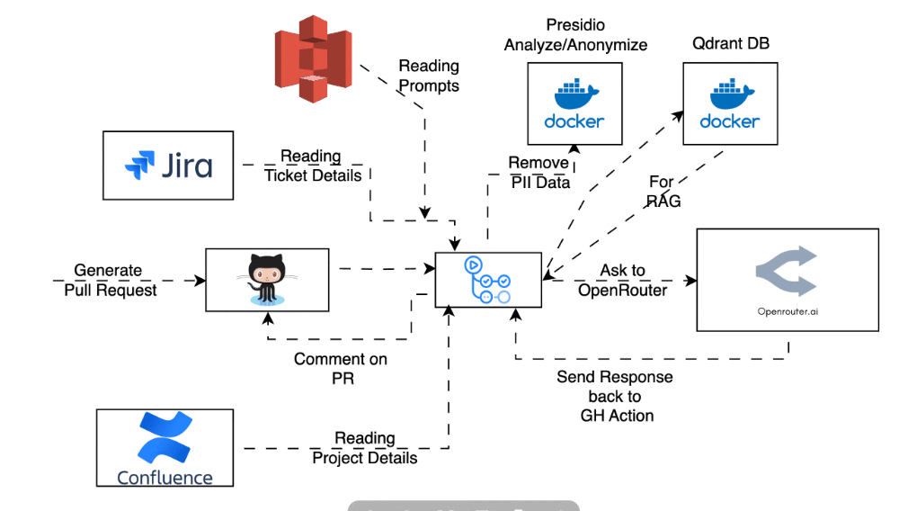

# Check Quality of Unit Testcases

GitHub Actions CI/CD


AI-powered GitHub Action for analyzing unit test quality and coverage metrics.

## Features
- Automated test quality assessment using AI analysis
- Jira integration for issue tracking.
- Customizable quality thresholds
- GitHub Actions CI/CD integration

## Prerequisites
- Node.js 18+
- npm 9+
- GitHub Actions environment
- Test list reports should be present in ./coverage/ut-results.json

## GitHub Actions Integration
Add to your workflow (`.github/workflows/quality-check.yml`):
```yaml
name: Test Quality Check
on: [push, pull_request]

jobs:
  analyze:
    runs-on: ubuntu-latest
    steps:
      - uses: actions/checkout@v4
      - name: Extract branch name
        id: extract
        run: |
          echo "branch=${{ github.head_ref }}" >> $GITHUB_OUTPUT

      - name: Run OpenRouterAI Test Quality Checker
        id: run-check-quality-of-unit-testcases-openrouterai
        uses: sfvishalgupta/check-quality-of-unit-testcases@v3.0
        with:
          AWS_ACCESS_KEY: ${{ secrets.AWS_ACCESS_KEY || '' }}
          AWS_SECRET_KEY: ${{ secrets.AWS_SECRET_KEY || '' }}
          AWS_REGION: ${{ vars.AWS_REGION || '' }}
          S3_BUCKET_NAME: ${{ vars.S3_BUCKET_NAME || '' }}

          DOCKER_USERNAME: ${{ vars.DOCKER_USERNAME || '' }}
          DOCKER_PASSWORD: ${{ secrets.DOCKER_PASSWORD || '' }}
          
          GITHUB_ISSUE_NUMBER: ${{ github.event.pull_request.number || 'main' }}
          GITHUB_TOKEN: ${{ secrets.GITHUB_TOKEN }}
          JIRA_API_TOKEN: ${{ secrets.JIRA_API_TOKEN }}
          
          JIRA_EMAIL: ${{ vars.JIRA_EMAIL }}
          JIRA_PROJECT_KEY: ${{ vars.JIRA_PROJECT_KEY }}
          JIRA_TICKET_ID: ${{ steps.extract.outputs.branch }}
          JIRA_URL: ${{ vars.JIRA_URL }}
          
          OPEN_ROUTER_API_KEY: ${{ secrets.OPEN_ROUTER_API_KEY }}
          OPEN_ROUTER_MODEL: ${{ vars.OPEN_ROUTER_MODEL }}
          PROJECT_DOCUMENT_PATH: ${{ vars.PROJECT_DOCUMENT_PATH || '' }}
          USE_FOR: ${{ vars.USE_FOR || '' }}
      
```
## Workflow


## Contributing
1. Fork the repository
2. Create feature branch (`git checkout -b feature/improvement`)
3. Commit changes (`git commit -am 'Add new feature'`)
4. Push to branch (`git push origin feature/improvement`)
5. Open Pull Request

## License
MIT © 2025 Vishal Gupta

## Support
Contact: vishal.gupta@sourcefuse.com
